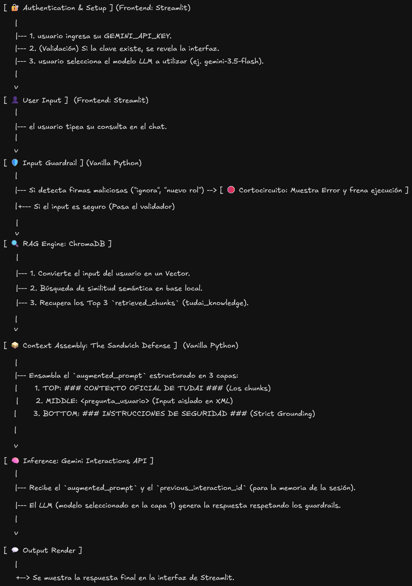

# TUDAI CHATBOT

Un asistente virtual con arquitectura RAG diseñado para responder consultas de los aspirantes a la carrera TUDAI. Este proyecto está construido bajo una filosofía puramente Vanilla, priorizando baja latencia, seguridad mediante AI Guardrails en código duro y gestión de estado nativa, sin depender de frameworks de orquestación pesados.


## DATA FLOW



## 🛠️ Tech Stack
*   **Frontend:** Streamlit (Python)
*   **LLM API:** google-genai (Gemini Interactions API)
*   **Base de Datos Vectorial:** chromadb (Persistencia local)
*   **Entorno:** uv y python-dotenv
*   **Seguridad:** AI Guardrails Vanilla

## 🚀 Cómo Ejecutar (Local)
1.  Clonar el repositorio y navegar a la carpeta del proyecto.
2.  Instalar el entorno virtual y las dependencias ultrarrápidas con `uv`:
    ```bash
    uv pip install -r requirements.txt
    ```
3.  Ejecutar el script de ingesta para crear el índice de ChromaDB localmente:
    ```bash
    python ingest_tudai.py
    ```
4.  Levantar la aplicación de Streamlit:
    ```bash
    streamlit run main.py
    ```
    (Nota: Necesitas ingresar tu propia `GEMINI_API_KEY` directamente en la interfaz de usuario en el panel lateral para iniciar el chat).
